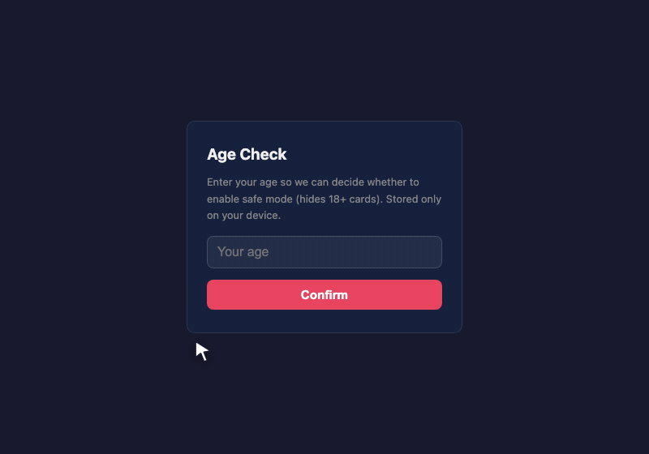

English | [简体中文](README.md)

<div align="center">


# FATI Tavern

**Drop in a character card and start chatting.**

Zero install · zero sign-up · zero backend — your API key and your chats never leave your device.

[Open the app →](https://fati-tavern.vercel.app) · [GitHub](https://github.com/dongzhang777-source/fati-tavern)



</div>

---

## What is this

A very lightweight, browser-only AI roleplay chat (a pure PWA):

1. **Drop in** a SillyTavern character card (PNG / JSON)
2. **Paste** your own API key — or pick the key-free tier
3. **Chat** — multiple sessions, streaming replies, everything stored in your own browser

## Quick start

### Use it right now

Open [https://fati-tavern.vercel.app](https://fati-tavern.vercel.app) in any modern browser — desktop or phone. Install it to your home screen as a PWA and it keeps working offline.

1. Open **⚙ Settings**, pick a preset (DeepSeek / Kimi / OpenAI / LM Studio / Ollama / custom), paste your key, then hit **Test connection & fetch models** to pick a model.
2. Drag a character card anywhere onto the page.
3. Click the card and start typing.

No key at hand? Choose the **key-free tier** and a small open model runs in your browser via WebGPU instead — nothing is sent anywhere.

### Local development

```bash
npm install
npm run dev      # dev server
npm test         # unit tests (vitest)
npm run lint     # oxlint
npm run build    # production build (tsc + vite + PWA)
```

Stack: React 19 + TypeScript + Zustand + Vite + vite-plugin-pwa. There are only 5 runtime dependencies — the WebGPU engine loads lazily as its own chunk — and the PNG parser, the SSE streaming client, and the IndexedDB layer are all hand-written.

Module boundaries: `tavern.ts` (parsing) → `api.ts` (network) → `db.ts` (persistence) → `store.ts` (state) → UI, one-way dependencies.

## Features

- 🃏 **SillyTavern card compatible** — v1/v2/v3 JSON, PNG (`chara`/`ccv3` chunks, gzip/zTXt compressed), lorebooks, `{{char}}`/`{{user}}` macros
- 🔑 **BYOK** — DeepSeek / Kimi / OpenAI / LM Studio / Ollama / any OpenAI-compatible endpoint; your key is stored only in `localStorage`
- ⚡ **Key-free tier** — in-browser local inference via WebLLM (WebGPU), no key of any kind
- 🔒 **Privacy-first** — no backend, nothing uploaded, no accounts; only anonymous feature-usage counters (visits / imports / messages sent / character edits / reply-suggestion use / second-turn conversations / shares created / shares opened / screenshot shares)
- 🔗 **Card sharing** — generates a gzip + base64url link; the payload lives only in the URL `#` fragment and never passes through this app's server
- 📸 **Chat screenshot export** — a long screenshot drawn on-device with Canvas, brand watermark at the bottom; share via the system sheet or download — it never leaves your device
- 🌐 **Four languages** — English / 简体中文 / 日本語 / 한국어, auto-detected and manually switchable
- 📱 **PWA** — same app on phone and desktop, installable to the home screen, opens offline
- 💛 **Safety baseline** — a permanent "this is AI roleplay, not a person" disclosure in chat; self-harm ideation is detected locally and met with crisis resources (12356 / 988)

## How it compares

| Compared to | FATI Tavern |
|---|---|
| vs Character.ai | Nobody else ever sees your conversations |
| vs SillyTavern | Zero install — open a web page and chat |
| vs Janitor AI | Completely free, no subscription wall |
| vs SpicyChat | Your API key stays on your device and never touches our servers |

## Privacy model

This is a static frontend. There is no FATI Tavern server sitting in the middle of your chats.

| Data | Where it lives | Uploaded? |
|---|---|---|
| API key | your browser's `localStorage` | No |
| Character cards | your browser's IndexedDB | No |
| Chat history | your browser's IndexedDB | No |
| Chat requests | straight to the endpoint you configured | Only to the provider you chose |

Notes:

- **Card-share links** encode the card as gzip + base64url into the URL fragment (the part after `#`). Browsers do not send the fragment to any server. The link data is removed from the address bar as soon as the link opens, and the card is only added to the library after you confirm the import.
- **Screenshots** are rendered locally with Canvas and saved or shared through your own system share sheet.
- **Usage counters** are anonymous, per-device, and content-free: they count that a feature was used, never what was in it. No chat text, no card data, no keys. If no analytics key is configured at build time, nothing is sent at all.

## Content & safety

- Character cards are third-party content that you import yourself. FATI Tavern does not host or distribute cards.
- On import, a card is labeled automatically from the content rating declared in its own metadata and tags, and that label is visible in your library. Cards labeled 18+ are hidden behind the age gate and are intended for adults only.
- Every chat shows a permanent disclosure that you are talking to an AI, not a person.
- If a conversation shows signs of self-harm ideation, the app surfaces crisis resources (12356 / 988). The detection runs locally — nothing is uploaded and nothing is blocked.

## Ecosystem transparency

FATI Tavern is an independent, permanently free, fully open-source product. It is also the open-source, try-it-in-your-browser on-ramp to the FATI ecosystem — the FATI desktop app goes deeper (local models, audio-visual immersion, co-op worldbuilding). We say this openly: the tavern experience is always complete, with no feature locks and no paywalls; you only see a pointer to FATI when you go looking for more yourself.

## License

[MIT](LICENSE)

## Documentation

- [User guide](docs/USER-GUIDE.md)
- [Architecture](docs/ARCHITECTURE.md)
- [P2P group chat guide](docs/P2P_USAGE.md)
- [Contributing](CONTRIBUTING.md)
- [Changelog](CHANGELOG.md)

Found a bug or want a feature? [Open an issue](https://github.com/dongzhang777-source/fati-tavern/issues).
